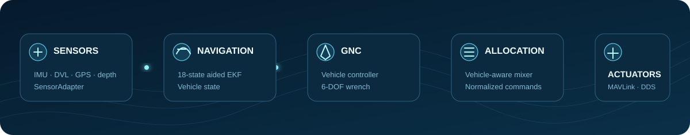

<h1>HydroX</h1>

<strong>Ocean-First, Cross-Domain Autopilot for Underwater, Surface, and Aerial Vehicles</strong>

A unified control and allocation architecture · Six vehicle archetypes · Designed for SITL, HITL, and real-world deployment

<a href="#overview">Overview</a> ·
<a href="#architecture">Architecture</a> ·
<a href="#vehicle-coverage">Vehicles</a> ·
<a href="#integration-contract">Integration</a> ·
<a href="#quick-start">Quick Start</a>

Concept visualization of a coordinated fleet spanning underwater, surface, and aerial vehicles.

---

## Overview

HydroX is a standalone, open-source C++17 autopilot implementation for underwater, surface, and aerial vehicles. It implements the complete GNC path from sensor processing and state estimation to guidance, control, allocation, actuator output, telemetry, and logging.

HydroX uses the same GNC core for software-in-the-loop (SITL), hardware-in-the-loop (HITL), and onboard deployment, with platform-specific interfaces handling sensors, actuators, and communications.

> [!NOTE]
> A shared state, control, and actuator contract keeps the estimator, controller, and allocator chain consistent across development, validation, and deployment.

### At a glance

| | Engineering focus | What HydroX provides |
|---|---|---|
| 🧭 | Navigation | A common 18-state aided EKF with UUV, USV, and UAV measurement/tuning profiles |
| 🎛️ | Control | Vehicle-specific control laws behind a common <code>IController</code> interface |
| ⚙️ | Allocation | A clean six-degree-of-freedom wrench boundary between control and actuators |
| 🚀 | Vehicle coverage | Controllers and allocators for underwater vehicles, surface vessels, multirotors, fixed-wing aircraft, and VTOL aircraft |
| 🌊 | Marine vehicle modeling | Fossen-based vehicle control parameters for underwater vehicles and surface vessels |
| 🔌 | Integration | MAVLink HIL over TCP, Micro XRCE-DDS over UDP, and MAVLink telemetry for QGroundControl |
| 📈 | Observability | XLog time-series recording plus focused tests for estimation, allocation, transport, and serialization |

## Architecture

### One control chain, multiple domains

HydroX separates what forces and moments the vehicle needs from how its actuators produce them. Every controller emits a six-degree-of-freedom wrench; a vehicle-specific allocator then maps that demand to fins, propellers, thrusters, rotors, or control surfaces.

That boundary keeps the estimator and GNC orchestration stable while vehicle geometry and actuator layouts change.

~~~text
Sensor frames
    → SensorAdapter
    → 18-state aided EKF
    → vehicle state
    → IController
    → 6-DOF force / moment demand
    → IAllocator
    → normalized actuator commands
    → actuator / transport interface
~~~

### Integration topology

~~~mermaid
flowchart LR
    SITL["SITL environment"]
    HITL["HITL bench"]
    REAL["Onboard computer"]
    HX["HydroX Autopilot"]
    AGENT["Micro XRCE-DDS Agent"]
    ROS["ROS 2 / mission application"]
    QGC["QGroundControl"]
    LOG["XLog recorder"]

    SITL <-->|"simulation I/O"| HX
    HITL <-->|"MAVLink HIL / hardware I/O"| HX
    REAL <-->|"platform I/O"| HX
    HX <-->|"telemetry + setpoint · UDP"| AGENT
    AGENT <-->|"DDS"| ROS
    HX -->|"MAVLink telemetry · UDP"| QGC
    HX -->|"binary time series"| LOG

    classDef core fill:#0a3048,stroke:#34d6ff,color:#ffffff,stroke-width:2px;
    classDef edge fill:#102334,stroke:#54768d,color:#ffffff;
    class HX core;
    class SITL,HITL,REAL,AGENT,ROS,QGC,LOG edge;
~~~

HydroX runs the same estimation, control, and allocation chain across SITL, HITL, and onboard environments. Each environment connects through the transport and platform interface appropriate to that deployment.

SITL and HITL execute the same `HilRuntime`: EKF update, feedback selection,
GNC, allocation, motor/energy accounting, mission state, command-authority
gate, arming and failsafe transitions are implemented once. The two apps only
supply platform transport, command ingress and integration telemetry.
Simulator networking, DDS, QGC, and PC logging remain SITL services rather
than embedded runtime dependencies.

ROS 2 applications exchange telemetry, actuator outputs, and GNC setpoints through an external Micro XRCE-DDS Agent. QGroundControl receives a separate, one-way MAVLink/UDP telemetry stream.

### Navigation core

The aided EKF estimates NED position, Euler attitude, body-frame velocity, IMU biases, and an optional NED environmental-medium velocity. `EstimationProfile` keeps the mathematical core common while selecting physically valid observations and `Q/R/P0` tuning for each vehicle class.

GNC consumes the EKF `NavigationState` by default. Simulator truth is a separate
diagnostic stream: publishing or logging it never changes the normal control
feedback. The only override is the explicit
`--control-feedback-source truth_debug` experiment mode; startup and runtime
logs label that mode because it does not validate estimator-closed-loop control.
Truth publication and truth-heading aid remain separate, default-off switches.

<strong>18-state vector</strong>

~~~text
[N, E, D,
 roll, pitch, yaw,
 u, v, w,
 b_ax, b_ay, b_az,
 b_gx, b_gy, b_gz,
 m_N, m_E, m_D]
~~~

The final vector is water current for UUV/USV profiles and reserved for wind in UAV profiles. UAV wind remains explicitly invalid until an airspeed or aerodynamic-relative-velocity observation is available.

| Vehicle class | Vertical aid | Velocity/position aids | Medium state |
|---|---|---|---|
| UUV | Pressure depth | Bottom/water-track DVL, surface-valid GPS, magnetometer | Estimated water current |
| USV | Mean-surface constraint | GPS, optional DVL, magnetometer | Estimated surface current when observable |
| UAV | GPS altitude | 3D GPS position/velocity, magnetometer | Wind-labelled but disabled until a relative-air observation exists |

## Vehicle coverage

HydroX provides controller and allocator implementations for six vehicle archetypes. This describes software coverage, not flight certification or completed hardware validation.

| Domain | Vehicle archetype | Actuation / control allocation |
|---|---|---|
| Underwater | Slender-body AUV | Cross-tail fins and propeller |
| Underwater | Thruster ROV / hovering AUV | Multi-thruster six-DOF allocation |
| Surface | USV / WAM-V | Differential twin-propeller control |
| Aerial | Multirotor | Quad-rotor thrust mixing |
| Aerial | Fixed-wing | Elevator, aileron, rudder, and throttle |
| Aerial | VTOL | Lift rotors, control surfaces, and pusher |

## Execution modes

| Mode | How HydroX runs | Primary interfaces |
|---|---|---|
| SITL | The PC executable closes the control loop with a simulated vehicle | TCP MAVLink HIL and ROS 2 integration |
| HITL | The standalone NuttX application runs the shared pipeline on Pixhawk 6C and exchanges simulated sensors/actuators with OceanX | HITL Router, board `ByteStream`, companion command source, watchdog |
| Real-world deployment | The same runtime will replace simulated I/O with real sensor and actuator drivers | Future NuttX board configuration and physical I/O adapters |

The default control contract is 100 Hz. The HITL application and supervisor are
implemented and host-tested, but a flashable image still requires the real
Pixhawk 6C NuttX board port, verified bootloader memory layout and device
mapping. The build deliberately refuses to emit a placeholder firmware image.

## Interfaces

| Peer | Transport | Direction | Default | Purpose |
|---|---|---|---|---|
| Simulator or adapter | MAVLink HIL over TCP | Bidirectional | <code>127.0.0.1:14600</code> | Sensor frames in; actuator controls out |
| Micro XRCE-DDS Agent | XRCE-DDS over UDP | Bidirectional | <code>127.0.0.1:8888</code> | ROS 2 telemetry and GNC setpoints |
| QGroundControl | MAVLink over UDP | HydroX → QGC | <code>255.255.255.255:14550</code> | Attitude, position, HUD, and system telemetry |
| XLog | Local binary file | HydroX → log | Configurable | Estimator, setpoint, control, allocation, and diagnostic records |

The ROS 2 topic namespace is vehicle-aware. See [<code>include/dds_topic_manifest.h</code>](include/dds_topic_manifest.h) for the authoritative topic names, directions, rates, and message types.

> [!IMPORTANT]
> HydroX publishes state and actuator data through DDS and subscribes to high-level GNC setpoints. Simulation and hardware integrations can bridge their native topics or I/O to the HydroX transport and message contracts.

## Integration contract

HydroX keeps the autopilot loop separate from the simulation or hardware endpoint. An integration only needs to exchange sensor data and actuator commands through the contracts below.

### MAVLink HIL endpoint

The SITL process opens a TCP connection to the configured MAVLink HIL endpoint. By default, it connects to <code>127.0.0.1:14600</code> and runs the control loop at 100 Hz.

| Direction | Required message | Purpose |
|---|---|---|
| Endpoint → HydroX | <code>HIL_SENSOR</code> | Required IMU and pressure data for estimator propagation |
| Endpoint → HydroX | <code>HIL_GPS</code> | Optional position and velocity aid |
| Endpoint → HydroX | <code>HIL_DVL</code> | Optional DVL body velocity aid; HydroX extension, message ID 11060 |
| HydroX → endpoint | <code>HIL_ACTUATOR_CONTROLS</code> | Normalized commands for the simulated plant; HITL never drives physical outputs |

The endpoint should apply each actuator command to its vehicle model or I/O layer, then return the next sensor sample. <code>HIL_SENSOR</code> is the minimum input required to advance the control loop.

### ROS 2 and DDS bridge

An optional Micro XRCE-DDS Agent exposes the autopilot to ROS 2. HydroX publishes vehicle state, sensor summaries, actuator outputs, and status under <code>/hydrox/&lt;vehicle&gt;/out/...</code>, and receives high-level GNC setpoints from <code>/hydrox/&lt;vehicle&gt;/in/setpoint</code>.

For a ROS 2 based simulator or hardware integration, a bridge node can map native sensor topics to the MAVLink HIL input contract and map HydroX actuator outputs to the native actuator interface. The complete topic names, message types, directions, and rates are defined in [<code>include/dds_topic_manifest.h</code>](include/dds_topic_manifest.h).

## Quick start

### Prerequisites

- Git
- CMake 3.16 or newer
- A C++17 compiler
  - Windows: Visual Studio 2022 recommended
  - Linux: GCC or Clang, plus OpenSSL development files
- Eigen 3.4
- Network access during the first configure so CMake can fetch Micro-CDR and Micro XRCE-DDS Client

### 1. Clone HydroX and prepare Eigen

~~~bash
git clone https://github.com/xuheda/HydroX.git
cd HydroX

git clone --depth 1 --branch 3.4.0 \
  https://gitlab.com/libeigen/eigen.git \
  third_party/eigen
~~~

If GitLab is slow or unavailable in your region:

~~~bash
git clone --depth 1 --branch 3.4.0 \
  https://gitee.com/mirrors/eigen.git \
  third_party/eigen
~~~

### 2. Build the SITL executable

#### Windows

~~~powershell
.\build_sitl.bat
~~~

Output:

~~~text
build\sitl\Release\hydrox_sitl.exe
~~~

#### Linux

~~~bash
bash build_sitl.sh
~~~

Output:

~~~text
build/sitl/hydrox_sitl
~~~

### 3. Run

Start the OceanX simulation endpoint first, then launch HydroX SITL:

~~~powershell
.\build\sitl\Release\hydrox_sitl.exe
~~~

~~~bash
./build/sitl/hydrox_sitl
~~~

The default endpoints are the MAVLink HIL connection at <code>127.0.0.1:14600</code>, the Micro XRCE-DDS Agent at <code>127.0.0.1:8888</code>, and the QGroundControl broadcast port at <code>14550</code>. These endpoints are configurable at launch.

To deploy the Windows SITL executable beside an external integration runtime:

~~~powershell
.\build_sitl.bat hydrox_sitl C:\Path\To\Runtime\Dir
~~~

On Linux, deploy the native executable in the same way:

~~~bash
bash build_sitl.sh hydrox_sitl /path/to/runtime-dir
~~~

### 4. Build and run tests

Windows:

~~~powershell
cmake --build build/sitl --config Release
ctest --test-dir build/sitl -C Release --output-on-failure
~~~

Linux:

~~~bash
cmake --build build/sitl --parallel
ctest --test-dir build/sitl --output-on-failure
~~~

The PC build currently registers 24 CTest cases covering EKF behavior, control
allocation, DDS/CDR serialization, connection state, sensor adaptation,
MAVLink signing, SITL configuration, logging, platform adapters, HydroBus,
command-authority gating, and periodic scheduling.

## Build targets

| Target | Role |
|---|---|
| <code>hydrox</code> | Reusable static GNC library |
| <code>hydrox_sitl</code> | Windows/Linux SITL reference executable |
| <code>hydrox_hitl_router</code> | Frame-preserving OceanX TCP ↔ board serial bridge |
| <code>hydrox_pixhawk6c_hitl</code> | HITL-only firmware target for Pixhawk 6C / STM32H743 |

> [!NOTE]
> <code>hydrox_pixhawk6c_hitl.bin</code> is a generated build artifact, not a source file. The target currently defines the firmware boundary and refuses to configure without a real Pixhawk 6C NuttX board port. Board startup, a verified bootloader-compatible memory layout, non-blocking HIL and companion links, timers, and watchdog integration are still required before the image is flashable.

### Pixhawk 6C HITL firmware

The standalone HITL firmware build is isolated from the PC dependencies used by
<code>hydrox_sitl</code>. Hardware-specific code lives only in
<code>boards/pixhawk6c/</code>. That directory must contain the real
NuttX board startup, verified memory layout, device registration, and the
temporary CMake bridge defining <code>hydrox_pixhawk6c_bsp</code>.

HydroX pins the official NuttX 13.0.0 OS and Apps source archives and their
SHA-512 values in <code>third_party/nuttx.lock.json</code>. Fetch and verify
them with <code>tools/fetch_nuttx.ps1</code> or
<code>tools/fetch_nuttx.sh</code>.

Windows:

~~~powershell
.\build_pixhawk6c_hitl.bat
~~~

Linux:

~~~bash
./build_pixhawk6c_hitl.sh
~~~

After the BSP is implemented, a successful build produces:

~~~text
build/pixhawk6c_hitl/firmware/hydrox_pixhawk6c_hitl.elf
build/pixhawk6c_hitl/firmware/hydrox_pixhawk6c_hitl.bin
build/pixhawk6c_hitl/firmware/hydrox_pixhawk6c_hitl.map
~~~

The desktop router is already buildable:

~~~powershell
.\build\sitl\Release\hydrox_hitl_router.exe `
  --serial COM7 --baud 921600 --ue-host 127.0.0.1 --ue-port 14600
~~~

It preserves complete MAVLink 2 frames in both directions, including signed
frames, and reconnects either side without replaying an old partial frame.

### Shared vehicle parameters

OceanX vehicle profiles may declare an explicit `control_bundle`. The
orchestrator then launches SITL with `--vehicle-bundle` and does not silently
select legacy parameters. `VehicleBundle` computes an FNV-1a fingerprint of
the exact source bytes; SITL prints it, and the board-provided HITL profile must
declare the same profile ID and fingerprint or the firmware entry refuses to
start. This makes a parameter mismatch visible before actuator authority is
possible.

## Project map

| Path | Responsibility |
|---|---|
| [<code>include/</code>](include/) | Public interfaces, state types, estimator, and transport contracts |
| [<code>src/</code>](src/) | Core library implementation |
| [<code>src/gnc/</code>](src/gnc/) | Controllers, control allocators, reference models, and factory |
| [<code>src/sitl/</code>](src/sitl/) | SITL configuration, integration support, DDS worker, and XLog integration |
| [<code>src/transport/</code>](src/transport/) | Host TCP transport implementation |
| [<code>src/runtime/</code>](src/runtime/) | HydroX bus, scheduler, parameters, logging, safety, and HIL policy |
| [<code>platform/api/</code>](platform/api/) | OS- and board-independent platform contracts |
| [<code>platform/host/</code>](platform/host/) | Windows/Linux platform adapters |
| [<code>platform/nuttx/</code>](platform/nuttx/) | NuttX platform adapters shared by embedded boards |
| [<code>apps/sitl/</code>](apps/sitl/) | Host transport, DDS/QGC/XLog integration around the shared runtime |
| [<code>apps/hitl_router/</code>](apps/hitl_router/) | Frame-preserving TCP/serial HITL router |
| [<code>apps/pixhawk6c_hitl/</code>](apps/pixhawk6c_hitl/) | Validated Pixhawk 6C NuttX HITL application entry |
| [<code>boards/pixhawk6c/</code>](boards/pixhawk6c/) | Pixhawk 6C startup, memory, buses, DMA, and device registration |
| [<code>docs/development_structure.html</code>](docs/development_structure.html) | Browser-readable Stage 2 architecture and SITL/HITL alignment |
| [<code>cmake/targets/pixhawk6c_hitl.cmake</code>](cmake/targets/pixhawk6c_hitl.cmake) | HITL firmware target and artifact contract |
| [<code>cmake/toolchains/arm_none_eabi_gcc.cmake</code>](cmake/toolchains/arm_none_eabi_gcc.cmake) | GNU Arm cross-compiler and Cortex-M7 ABI selection |
| [<code>tests/</code>](tests/) | Focused unit tests |
| [<code>docs/</code>](docs/) | Architecture notes and project assets |

## Documentation

- [Documentation home](docs/index.html): separate HydroX architecture, control, vehicle-contract, and implementation documentation
- [Stage 2 development structure](docs/development_structure.html): independent firmware boundary, NuttX/Pixhawk 6C route, and SITL/HITL alignment
- [Codebase overview](docs/codebase_overview.html): module boundaries and control flow
- [Control architecture](docs/control_architecture.html): estimator, GNC, MAVLink HIL, controllers, and allocators
- [ROS 2 topics and interface contract](docs/ros_interfaces.html): topics, services, actions, QoS, rates, frames, timeouts, and DDS mapping
- [Control methods](docs/control_methods.html): controller and allocator behavior by vehicle archetype
- [Vehicle bundles](docs/vehicle_bundles.html): simulator-independent vehicle control configuration
- [DDS topic manifest](include/dds_topic_manifest.h): machine-readable bare-DDS names, types, IDs, directions, and rates
- [Third-party notices](THIRD_PARTY_NOTICES.md): dependency licenses and attribution

## Contributing

Issues and pull requests are welcome. When adding a new vehicle archetype, keep control-law logic behind <code>IController</code>, actuator mapping behind <code>IAllocator</code>, and extend the relevant tests with the implementation.

## License

HydroX is released under the [Apache License 2.0](LICENSE). Third-party components are documented in [THIRD_PARTY_NOTICES.md](THIRD_PARTY_NOTICES.md).
