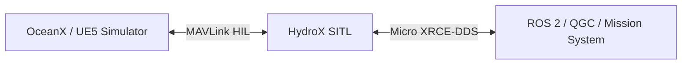
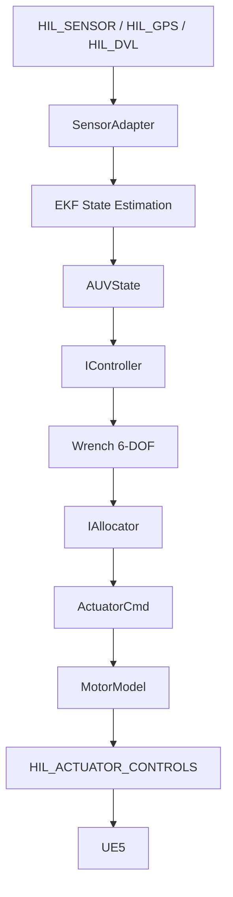
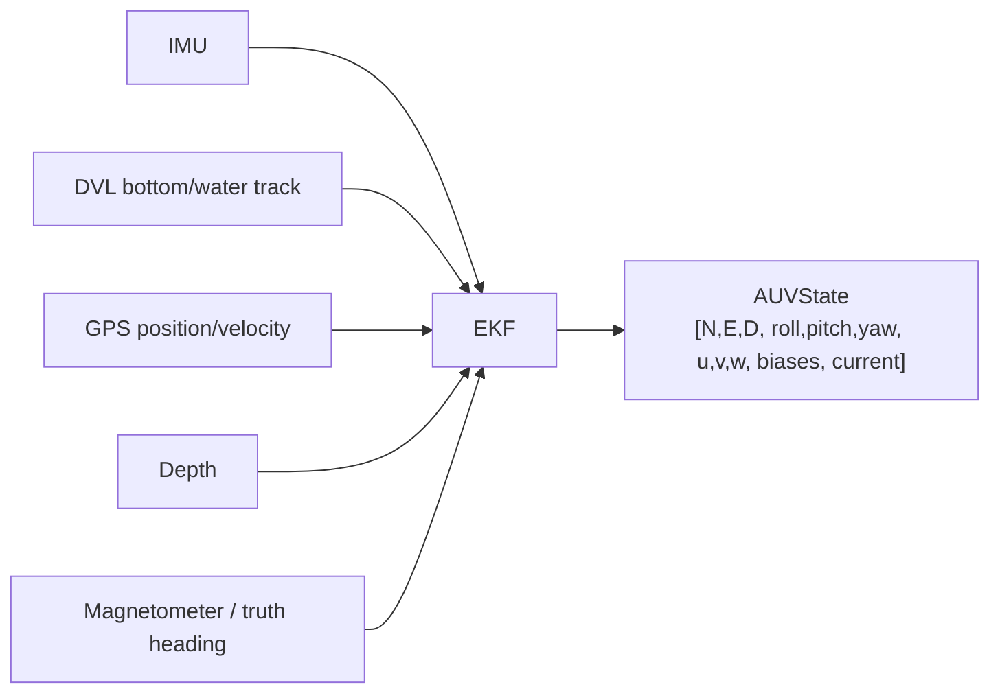
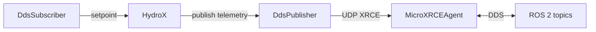
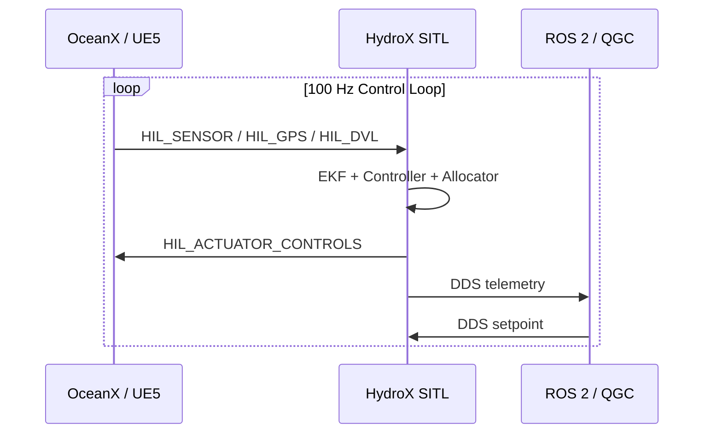

# HydroX

HydroX is a software-in-the-loop (SITL) flight-control runtime for marine and cross-domain autonomy. It provides navigation, guidance, control, allocation, and MAVLink HIL interfaces for vehicles running in simulation or on embedded platforms.

This repository contains the HydroX autopilot core. It is designed to be built standalone and can be integrated with simulators such as OceanX via the MAVLink HIL protocol.



## Features

- Fossen-style 6-DOF marine dynamics and vehicle parameter models
- EKF-based state estimation
- Multi-domain controllers: AUV, ROV, surface vessel, multirotor, fixed-wing, VTOL
- MAVLink HIL sensor and actuator interfaces
- Micro XRCE-DDS client for ROS 2 / mission-system integration
- Extensive unit-test coverage

## GNC Pipeline



## Supported Vehicle Domains

HydroX ships with controllers and allocators for:

| Domain | Vehicle | Control Style |
|---|---|---|
| Underwater | Slender-body AUV | Cross-tail fins + propeller |
| Underwater | ROV / AUV | Thruster array (6-DOF) |
| Surface | USV / WAMV | Dual propellers |
| Air | Multirotor | Quad-rotor thrust mixing |
| Air | Fixed-wing | Elevator / aileron / rudder / throttle |
| Air | VTOL | Lift rotors + control surfaces + pusher |

## EKF State Estimation

An 18-state mixed-mode aided EKF fuses IMU, DVL, GPS, depth, and compass measurements:



State vector:

```text
[N, E, D, roll, pitch, yaw, u, v, w, b_ax, b_ay, b_az, b_gx, b_gy, b_gz, c_N, c_E, c_D]
```

## DDS / ROS 2 Integration



Key topics include `/vehicle_local_position`, `/sensor_combined`, `/actuator_outputs`, `/vehicle_status`, and `/setpoint`. See [`include/dds_topic_manifest.h`](include/dds_topic_manifest.h) for the full list.

## Repository Layout

| Path | Role |
|---|---|
| `include/` | Public headers |
| `src/` | Core library implementation |
| `src/sitl/` | SITL-specific runtime code |
| `src/transport/` | MAVLink / serial / TCP transport implementations |
| `src/gnc/` | Controllers and allocators |
| `apps/sitl/` | SITL executable entry point |
| `apps/stm32/` | STM32 embedded executable entry point |
| `tests/` | Unit tests |
| `cmake/` | CMake toolchain files |
| `third_party/` | External dependencies (Eigen, downloaded manually) |
| `docs/` | Project documentation |

## Build

### Dependencies

- CMake 3.16+
- C++17 compiler (Visual Studio 2022 on Windows, GCC/Clang on Linux)
- Eigen 3.4+ (clone manually before building, see below)
- A network connection for the first build (Micro XRCE-DDS is downloaded automatically by CMake)

### Get Eigen

Before building HydroX, clone Eigen into `third_party/eigen`:

```bash
git clone --depth 1 --branch 3.4.0 \
    https://gitlab.com/libeigen/eigen.git \
    third_party/eigen
```

For users in China, use the gitee mirror:

```bash
git clone --depth 1 --branch 3.4.0 \
    https://gitee.com/mirrors/eigen.git \
    third_party/eigen
```

### Windows

```bat
build_sitl.bat
```

To also deploy the built executable to an external runtime directory (for example, next to the OceanX packaged runtime):

```bat
build_sitl.bat hydrox_sitl C:\Path\To\Runtime\Dir
```

### Linux

```bash
bash build_sitl.sh
```

### STM32 (cross-compile)

```bash
mkdir build_stm32 && cd build_stm32
cmake .. -DCMAKE_TOOLCHAIN_FILE=../cmake/toolchain_stm32h7.cmake -DHYDROX_TARGET=STM32
cmake --build . -j$(nproc)
```

## Run Tests

After building:

```bat
cd build_sitl
ctest -C Release --output-on-failure
```

## Integration with OceanX

HydroX is developed as part of the OceanX simulator ecosystem. When built from within the OceanX workspace, `build_sitl.bat` can deploy `hydrox_sitl.exe` next to the packaged Unreal runtime. Standalone builds produce the executable under `build_sitl/Release/`.

HydroX and OceanX communicate exclusively through the MAVLink HIL protocol, so either project can be developed and tested independently.



## License

HydroX is licensed under the Apache License 2.0. See [LICENSE](LICENSE).

Third-party licenses are listed in [THIRD_PARTY_NOTICES.md](THIRD_PARTY_NOTICES.md).
