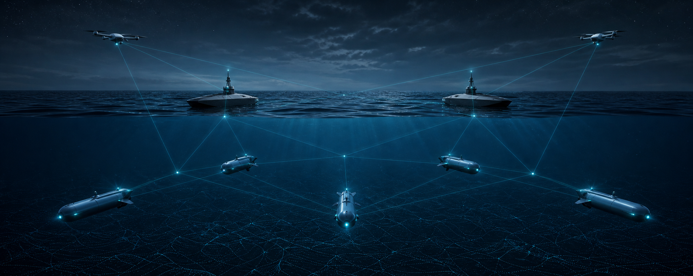

<div align="center">


<h1>HydroX</h1>

<p><strong>Ocean-first autopilot for underwater, surface, aerial, and ground vehicles</strong></p>

<p>
A shared guidance, navigation, control, and allocation core for SITL, HITL, and supported onboard deployments.
</p>

<p>
<a href="https://isocpp.org/"></a>
<a href="https://cmake.org/"></a>


<a href="LICENSE"></a>
</p>
</div>

## Overview

HydroX is an open-source C++17 autopilot for coordinated underwater, surface, aerial, and ground vehicles. It provides a common path from sensor input and state estimation through guidance, control, actuator allocation, telemetry, and logging.

The same control core runs in software-in-the-loop (SITL), hardware-in-the-loop (HITL), and supported onboard deployments. Platform adapters connect that core to the sensors, actuators, and transport used by each environment.

The current release is `1.0.0`. The FMUv6C image has been verified on the target hardware and is ready for HITL deployment.

### What HydroX provides

| Area | Capability |
|---|---|
| Navigation | An 18-state aided EKF with profiles for UUV, USV, and UAV vehicles |
| Control | Vehicle-specific control laws behind a common `IController` interface |
| Allocation | Six-degree-of-freedom force and moment allocation through `IAllocator` |
| Vehicle support | AUVs, ROVs, USVs, multirotors, fixed-wing aircraft, VTOL aircraft, and differential-drive vehicles |
| Integration | MAVLink HIL over TCP and Micro XRCE-DDS over UDP |
| Observability | XLog time-series recording and focused integration tests |

## Architecture

HydroX separates the force and moment requested by a controller from the way a vehicle's actuators produce them. Each controller emits a six-degree-of-freedom wrench; the vehicle allocator maps it to fins, propellers, thrusters, rotors, or control surfaces.

```text
Sensor frames
    → SensorAdapter
    → 18-state aided EKF
    → vehicle state
    → IController
    → 6-DOF force / moment demand
    → IAllocator
    → normalized actuator commands
    → actuator / transport interface
```

The same chain is used in SITL, HITL, and onboard environments. The default control period is 100 Hz, with 500 ms sensor and setpoint timeouts.

## Supported vehicles

| Domain | Vehicle | Actuation / allocation |
|---|---|---|
| Underwater | Slender-body AUV | Cross-tail fins and propeller |
| Underwater | Thruster ROV / hovering AUV | Multi-thruster six-DOF allocation |
| Surface | USV / WAM-V | Differential twin-propeller control |
| Aerial | Multirotor | Quad-rotor thrust mixing |
| Aerial | Fixed-wing | Elevator, aileron, rudder, and throttle |
| Aerial | VTOL | Lift rotors, control surfaces, and pusher |
| Ground | Differential-drive rover | Differential wheel force and yaw allocation |

## Execution modes

| Mode | Description | Main interfaces |
|---|---|---|
| SITL | A PC process closes the control loop with a simulated vehicle | TCP MAVLink HIL and ROS 2 |
| HITL | The shared pipeline runs on Pixhawk 6C Mini / FMUv6C while a simulator supplies vehicle inputs | HITL Router, board `ByteStream`, and companion command source |
| Onboard | The same runtime connects to real sensors and actuators through platform drivers | NuttX platform and board adapters |

## Interfaces

| Peer | Transport | Direction | Default | Purpose |
|---|---|---|---|---|
| Simulator or adapter | MAVLink HIL over TCP | Bidirectional | `127.0.0.1:14600` | Sensor frames in; actuator commands out |
| Micro XRCE-DDS Agent | XRCE-DDS over UDP | Bidirectional | `127.0.0.1:8888` | ROS 2 telemetry and GNC setpoints |
| XLog | Local binary file | HydroX → log | Enabled in SITL | Estimator, setpoint, control, allocation, safety, and diagnostic records |

### MAVLink HIL endpoint

The SITL process connects to the configured MAVLink HIL endpoint and runs the control loop at 100 Hz.

| Direction | Message | Purpose |
|---|---|---|
| Endpoint → HydroX | `HIL_SENSOR` | Required IMU and pressure data |
| Endpoint → HydroX | `HIL_GPS` | Optional position and velocity aid |
| Endpoint → HydroX | `HIL_DVL` | Optional body-frame DVL velocity aid; message ID 11060 |
| HydroX → endpoint | `HIL_ACTUATOR_CONTROLS` | Normalized commands for the simulated vehicle |

`HIL_SENSOR` is the minimum input required to advance the control loop. The endpoint applies each actuator command to its vehicle model or I/O layer and returns the next sensor sample.

### ROS 2 and DDS

An optional Micro XRCE-DDS Agent exposes HydroX to ROS 2. HydroX publishes vehicle state, sensor summaries, actuator outputs, and status under:

```text
/hydrox/<vehicle>/out/...
```

High-level GNC setpoints are received from:

```text
/hydrox/<vehicle>/in/setpoint
```

The complete topic names, message types, directions, and rates are defined in [`include/dds_topic_manifest.h`](include/dds_topic_manifest.h).

## Quick start

### Prerequisites

- Git
- CMake 3.16 or newer
- A C++17 compiler
  - Windows: Visual Studio 2022 recommended
  - Linux: GCC or Clang, plus OpenSSL development files
- Eigen 3.4
- Network access during the first configure so CMake can fetch Micro-CDR and Micro XRCE-DDS Client

### 1. Clone HydroX and prepare Eigen

```bash
git clone https://github.com/xuheda/HydroX.git
cd HydroX

git clone --depth 1 --branch 3.4.0 \
  https://gitlab.com/libeigen/eigen.git \
  third_party/eigen
```

If GitLab is unavailable in your region, use the mirror:

```bash
git clone --depth 1 --branch 3.4.0 \
  https://gitee.com/mirrors/eigen.git \
  third_party/eigen
```

### 2. Build SITL

Windows:

```powershell
.\build_sitl.bat
```

Output:

```text
build\sitl\Release\hydrox_sitl.exe
```

Linux:

```bash
bash build_sitl.sh
```

Output:

```text
build/sitl/hydrox_sitl
```

### 3. Run SITL

Start a compatible simulation endpoint, then launch HydroX from the repository root with a vehicle bundle:

```powershell
.\build\sitl\Release\hydrox_sitl.exe --vehicle-bundle profiles/eca-a9/vehicle-bundle.json
```

```bash
./build/sitl/hydrox_sitl --vehicle-bundle profiles/eca-a9/vehicle-bundle.json
```

The default endpoints are the MAVLink HIL connection at `127.0.0.1:14600` and the Micro XRCE-DDS Agent at `127.0.0.1:8888`. Both can be changed at launch. HydroX does not start the simulator, DDS Agent, or mission application.

### 4. Build and run tests

Windows:

```powershell
cmake --build build/sitl --config Release
ctest --test-dir build/sitl -C Release --output-on-failure
```

Linux:

```bash
cmake --build build/sitl --parallel
ctest --test-dir build/sitl --output-on-failure
```

The PC build registers tests covering EKF behavior, control allocation, DDS/CDR serialization, sensor adaptation, transport, SITL/HITL configuration, safety transitions, logging, and scheduling.

## Pixhawk 6C Mini / FMUv6C HITL

The embedded integration is separated from PC-only SITL dependencies.

- Board integration: `boards/fmu_v6c`
- NuttX application: `nuttx_apps/external/hydrox_hitl`
- Shared embedded source manifest: `cmake/hitl_core_sources.cmake`
- Windows build and packaging: `build_pixhawk6c_hitl.bat`

HydroX pins the official NuttX 13.0.0 OS and Apps archives in `third_party/nuttx.lock.json`. Fetch them with `tools/fetch_nuttx.ps1` or `tools/fetch_nuttx.sh`, then prepare the external application with `tools/prepare_nuttx_external.ps1` or `tools/prepare_nuttx_external.sh`.

The desktop HITL Router connects the simulator to the board. Run one Router for each vehicle and serial link:

```powershell
.\build\sitl\Release\hydrox_hitl_router.exe `
  --serial COM7 --baud 921600 --ue-host 127.0.0.1 --ue-port 14600
```

The Router preserves complete MAVLink 2 frames and reconnects either side without replaying an old partial frame.

## Build targets

| Target | Role |
|---|---|
| `hydrox` | Reusable static GNC library |
| `hydrox_sitl` | Windows/Linux SITL executable |
| `hydrox_hitl_router` | TCP-to-board-serial HITL bridge |
| `hydrox_hitl_command_simulator` | Host-side HITL command-path simulator |
| `hydrox_control_shadow` | Offline control and allocation replay against XLog |
| `hydrox_xlog_integrity` | XLog integrity checker |
| `hydrox_pixhawk6cmini_hitl` | NuttX packaging target for Pixhawk 6C Mini / FMUv6C |

## Project layout

| Path | Responsibility |
|---|---|
| [`include/`](include/) | Public interfaces, state types, estimator, and transport contracts |
| [`src/`](src/) | Core library implementation |
| [`src/gnc/`](src/gnc/) | Controllers, allocators, reference models, and factory |
| [`src/sitl/`](src/sitl/) | SITL configuration and integration support |
| [`src/runtime/`](src/runtime/) | Runtime bus, scheduler, parameters, logging, and safety |
| [`platform/`](platform/) | Host and NuttX platform adapters |
| [`apps/`](apps/) | SITL, HITL Router, and embedded application entry points |
| [`boards/fmu_v6c/`](boards/fmu_v6c/) | Pixhawk 6C Mini/FMUV6C board integration |
| [`tests/`](tests/) | Unit and integration tests |
| [`docs/`](docs/) | Architecture notes and project documentation |

## Documentation

- [Documentation home](docs/index.html)
- [SITL/HITL parity contract](docs/sitl_hitl_parity.html)
- [Codebase overview](docs/codebase_overview.html)
- [Control architecture](docs/control_architecture.html)
- [ROS 2 interfaces](docs/ros_interfaces.html)
- [Control methods](docs/control_methods.html)
- [Vehicle bundles](docs/vehicle_bundles.html)
- [DDS topic manifest](include/dds_topic_manifest.h)
- [Third-party notices](THIRD_PARTY_NOTICES.md)

## Contributing

Issues and pull requests are welcome. New vehicle types should keep control logic behind `IController`, actuator mapping behind `IAllocator`, and include focused tests for the new behavior.

## License

HydroX is released under the [Apache License 2.0](LICENSE). Third-party components are documented in [THIRD_PARTY_NOTICES.md](THIRD_PARTY_NOTICES.md).
